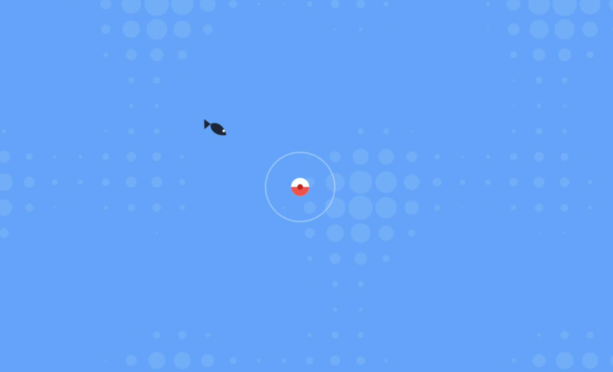

# Fishing Game

A lightweight browser-based fishing minigame inspired by Animal Crossing and Stardew Valley, built with vanilla JavaScript and the HTML5 Canvas API.

Wait for a fish to bite and react quickly to hook it with the SPACE key. Once hooked, play a fast reflex-based reeling minigame where you must keep the fish inside the catch zone to fill your progress bar.

Play online: https://jm-wltr.github.io/fishing-game/

